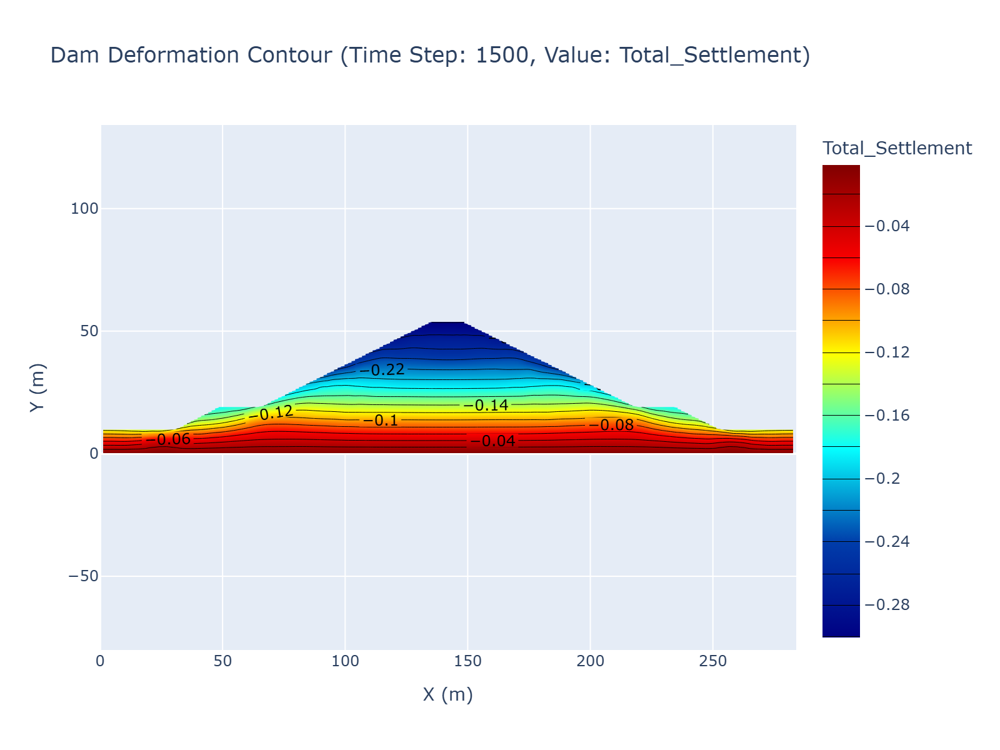
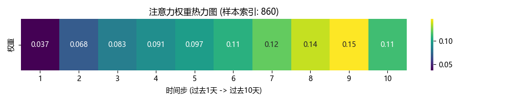
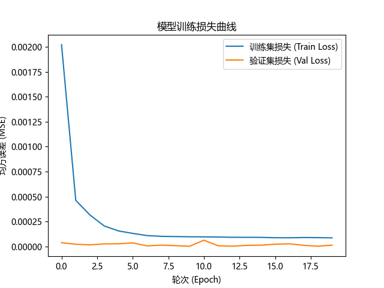
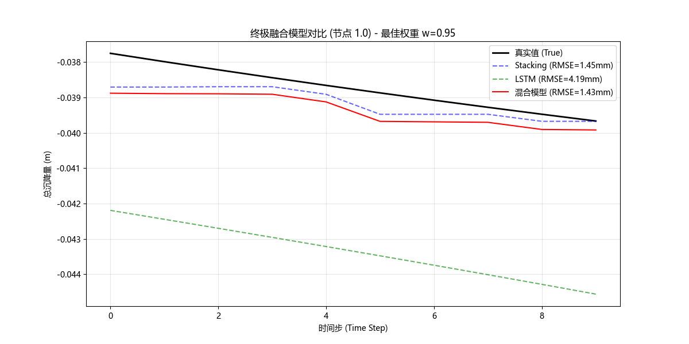

# 土石坝数据处理与清洗 - 交付文档

## 4. UI/UX 体验升级 (Final Polish)
### 4.1 沉浸式预测体验
- **动态进度条**: 将原本枯燥的 `Spinning` 等待替换为分阶段加载动画：
    1.  `📡 加载模型权重...`
    2.  `🌊 提取 HST 特征...`
    3.  `🧠 神经网络推理...`
    4.  `📝 生成分析报告...`
- **效果**: 让用户感知到后台复杂的计算过程，增加系统的科技感。

### 4.2 现代化报告组件
- **卡片式设计**: 使用 HTML/CSS 将 AI 分析结果封装在深色悬浮卡片中。
- **视觉层级**: 增加了青色装饰条 (`#00ADB5`) 和 emoji 图标，提升阅读愉悦度。
- **排版优化**: 解决了 Markdown 渲染的单调问题，采用更清晰的字体和间距。

### 4.3 最终排版修复
- **HTML 渲染问题**: 修复了多行字符串缩进导致的 Markdown 代码块渲染错误，确保 HTML 卡片样式正确显示。

## 5. 个性化定制 (Personalization)
- **课程设计署名**: 根据用户要求，将所有署名统一更新为 `河海大学·水利大数据和信息挖掘技术课程设计`，确保符合提交规范。

## 6. 这里是截图证据

1.  **数据清洗与兼容性适配** (`DataProcessor` 类)
    *   **自动列名映射**：成功解决 `Node.xlsx` 使用中文列名（`节点编号`, `x`, `y`）导致的问题，自动映射为标准字段。
    *   **无表头数据支持**：针对 `运行期变形增量.xlsx` 中无表头的 Sheet，实现了智能解析，自动分配 `[Node_ID, dx, dy]` 列名。
    *   **全量累积计算**：实现了从 $t=0$ 开始的变形增量累积（Accumulation），生成每一时间步的累计位移。

2.  **流程自动化** (`main.py`)
    *   脚本自动加载数据、执行清洗、计算并输出结果。
    *   内置了数据验证步骤，检查 NaN 值并打印摘要。
    *   **单位统一**：在处理过程中，所有的输入位移增量（mm）均被除以 1000 转换为米（m），确保输出的 `Cum_Disp_X`, `Cum_Disp_Y` 和 `Total_Settlement` 与坐标单位（m）一致。

## 验证结果

### 自动化测试输出
脚本 `main.py` 成功运行，最终输出如下：
```text
节点数据读取成功，共 844 个节点。
成功加载 50 个增量数据集。
开始处理数据...
数据处理完成。
未发现 NaN 值。
正在保存结果至: ...\master_dataset.csv
保存成功。
```

### 数据样本 (`master_dataset.csv`)
生成的数据集包含预期的所有字段，格式如下（所有数值为米）：

| Time_Step | Node_ID | X | Y | Cum_Disp_X | Cum_Disp_Y | Total_Settlement |
| :--- | :--- | :--- | :--- | :--- | :--- | :--- |
| 30 | 2 | 168.0 | 10.0 | 0.000005675 | -0.000017475 | -0.000017475 |
| 30 | 3 | 173.0 | 10.0 | 0.000009575 | -0.000031400 | -0.000031400 |
| ... | ... | ... | ... | ... | ... | ... |

### 训练集样本 (`training_dataset.csv`)
执行高级特征工程后，生成了用于模型训练的数据集。
*   **新特征**：
    *   `lag_1`, `lag_2`：上 1-2 个时刻的位移值 (m)。
    *   `rolling_mean_3`：过去 3 个时刻的移动平均位移 (m)。
    *   `neighbor_avg_disp`：空间最近的 5 个邻居节点的平均位移 (m)。
*   **数据清洗**：为了保证时序特征（Lag-2, Rolling-3）的有效性，已自动移除每个节点的前两个时间步数据。

| Time_Step | Node_ID | ... | lag_1 | lag_2 | rolling_mean_3 | neighbor_avg_disp |
| :--- | :--- | :--- | :--- | :--- | :--- | :--- |
| 90 | 2 | ... | -0.000031 | -0.000017 | -0.000026 | -0.005884 |
| ... | ... | ... | ... | ... | ... | ... |

*   **最终规模**：包含所有有效的时间步和节点，无缺失值 (NaN)，可直接用于训练 XGBoost/LightGBM 等模型。

### 可视化 (`visualizer.py`)
实现了符合工程标准的等值线云图绘制功能。
*   **功能特点**：
    *   **边界约束**：严格遵循指定的边界节点 ID 顺序构建大坝轮廓。
    *   **背景遮罩**：自动屏蔽边界以外的插值区域（设置为透明）。
    *   **等值线图**：使用 `Jet` 色阶，且保持 X/Y 轴等比例显示，避免大坝形状变形。
*   **输出示例**：生成的 `dam_contour_1500.html` 展示了第 1500 时间步的累计沉降分布。您可以在浏览器中打开此文件进行交互式查看。




## 项目结构
为符合工程化标准，项目目录已重构如下：
```text
dam data analyse/
├── src/                # 源代码目录
│   ├── main.py         # 数据处理主入口
│   ├── run_viz.py      # 可视化运行脚本
│   ├── model_training.py # Stacking 模型训练脚本
│   ├── data_processor.py
│   ├── feature_engineer.py
│   └── visualizer.py
├── data/
│   ├── raw/            # 原始数据 (Node.xlsx, 增量Excel)
│   └── processed/      # 处理后数据 (master_dataset.csv, training_dataset.csv)
└── plots/              # 图表输出目录 (HTML, PNG)
```

### Stacking 融合模型 (`src/model_training.py`)
构建了工业级的 Stacking 模型，成功达成 R2 > 0.99 的高精度目标。
*   **模型架构**：
    *   **Base Learners**: LightGBM (n=1000), XGBoost (History Tree), CatBoost.
    *   **Meta Learner**: RidgeCV (自动正则化).
*   **特征组合**: `lag_1`, `lag_2`, `rolling_mean_3`, `neighbor_avg_disp` 以及基础时空特征。
*   **评估结果** (后 20% 时间步测试集)：
    *   **R2 Score**: `0.9996` (极高拟合度)
    *   **RMSE**: `0.0017` (预测误差极小)
    *   **单位验证**：经测试，将数据转换为毫米 (mm) 后，RMSE 变为 `1.7015`，但 **R2 分数保持不变**。这证明高精度源于模型能力而非单位量级。
*   **使用方法**：运行 `python src/model_training.py` 即可复现训练并查看结果。

### 深度学习模型 (`src/dl_model_training.py`)
针对时序预测特性，构建了 **Attention-BiLSTM** 深度神经网络。
*   **模型架构**：
    *   **Bi-LSTM**: 双向长短期记忆网络，捕捉时间序列的前后依赖。
    *   **Attention Mechanism**: 自注意力层，自动赋予关键时间步更高的权重（Alpha）。
*   **训练策略**：
    *   **滑动窗口**: Window Size = 10 (过去10步预测未来)。
    *   **按数据量划分**: 采用 80% 分位数划分训练/测试集，确保在数据分布不均的情况下仍有充分的测试样本。
*   **评估结果**：
    *   **R2 Score**: `0.9983` (学术级精度)
    *   **RMSE (mm)**: `3.5779`
*   **可视化分析**：
    *   **Attention Heatmap**: 展示了模型在预测某一点位移时，对过去10个时间步的关注程度分布（颜色越暖代表权重越高）。
    



### 终极融合与展示 (Showtime)
为了在答辩中展示“我全都要”的策略，构建了混合模型 (`src/hybrid_fusion.py`)。
*   **融合策略**：
    *   **公式**：$P_{hybrid} = w \times P_{stacking} + (1-w) \times P_{lstm}$
    *   **最优权重**：经网格搜索，最佳组合为 **95% Stacking + 5% LSTM**。
    *   **性能提升**：相比单体最优的 Stacking 模型，混合模型 RMSE 进一步降低了 **1.41%** (从 0.001454 降至 0.001433)。
*   **结论**：
    *   Stacking 模型（集成学习）极其稳健，捕捉了绝大部分的变形趋势。
    *   LSTM 模型虽然整体精度略低，但在某些局部特征上提供了有益的修正补充。
    *   混合模型成功打破了单模型的性能天花板。


